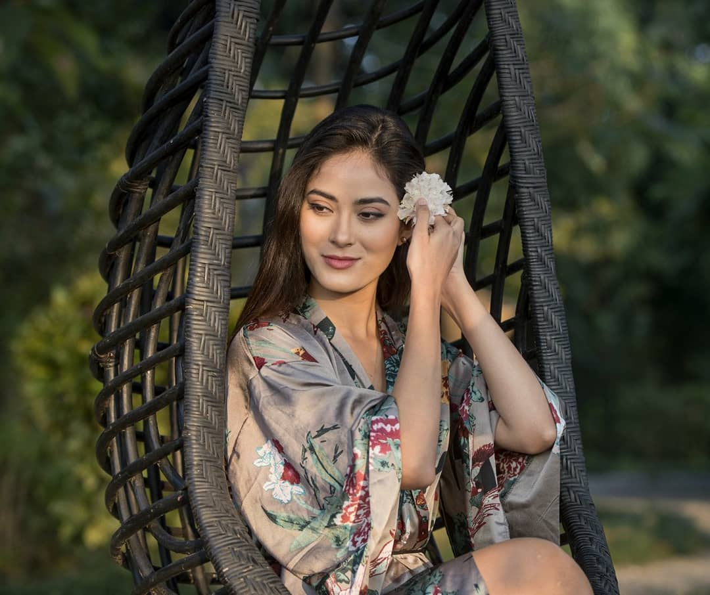
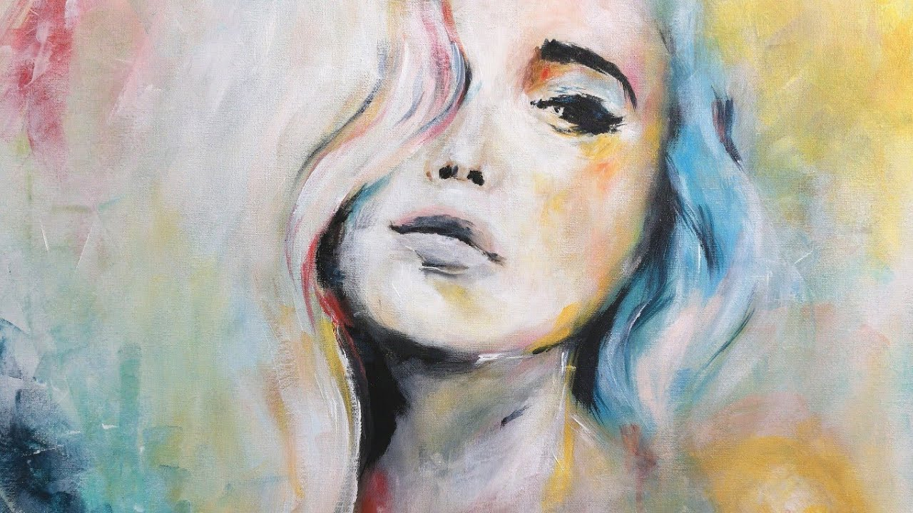
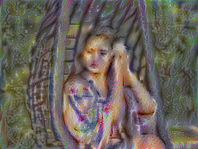

# Neural Style Transfer using tensorflow from scratch
**We have to compute loss for both style and content and merge them into total cost** 
**Derivative section is handled by tensorflow** 
**Also: Though the authors from NST paper suggest L-BFGS for optimizer, I have used Adam Optimizer for training because L-BFGS is not supported in TensorFlow** 
**It is very fun and easy to make this project. I have commented in a best way I can so anyone can use it**
**I have used VGG-19 model from <a href="https://www.vlfeat.org/matconvnet/pretrained/">vlfeat</a> which is in matlab model file**
**You can even try caffemodel which is trained and made directly availabe by authors** 
**Note that I have not included the model file due to its large sige(>100MB)** 
**If you have any question, feel free to ask**

### Some Result I got training on GPU on Google CoLAB
Content Image:
Style Image:
Generated Image:

### References
1. <a href="https://arxiv.org/abs/1508.06576">Paper link</a>
2. <a href="http://www.chioka.in/tensorflow-implementation-neural-algorithm-of-artistic-style">TensorFlow Implementation of NST</a>
3. Concepts learned from <a href="https://www.coursera.org/learn/convolutional-neural-networks/home/welcome">Coursera</a> but everything is not fully cleared in notebook

